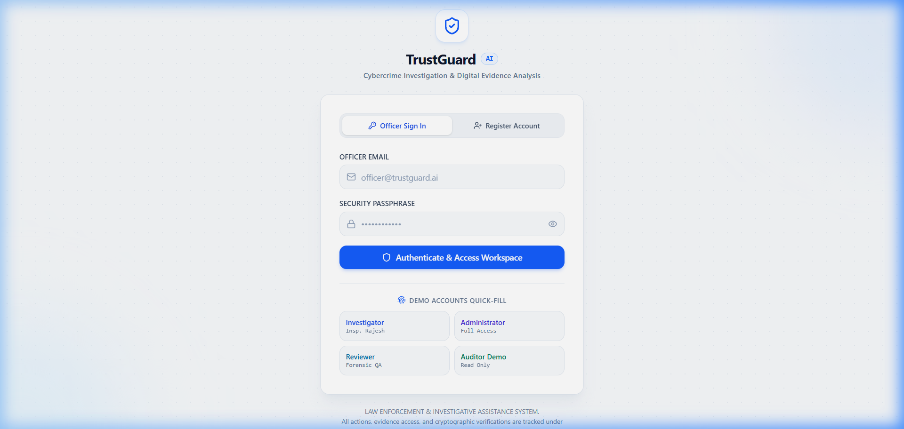
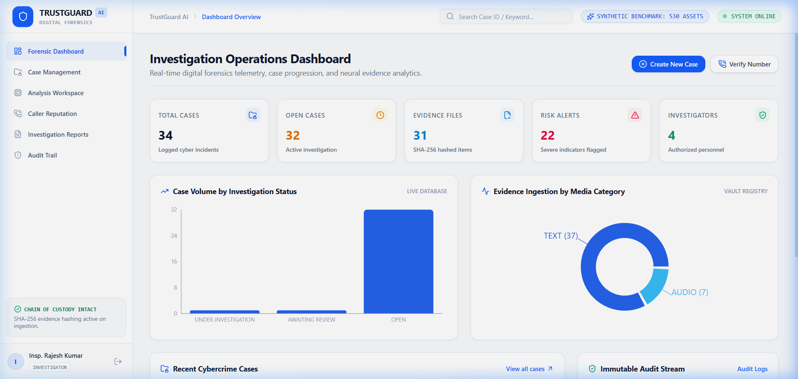
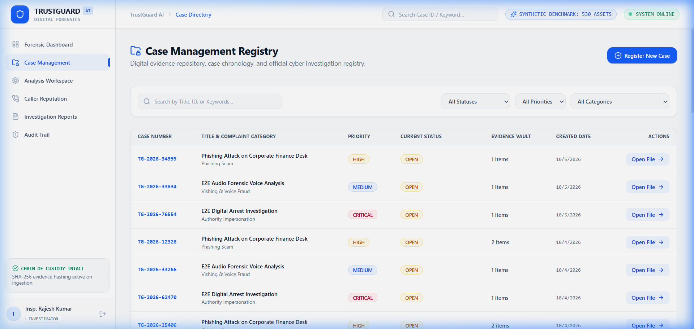
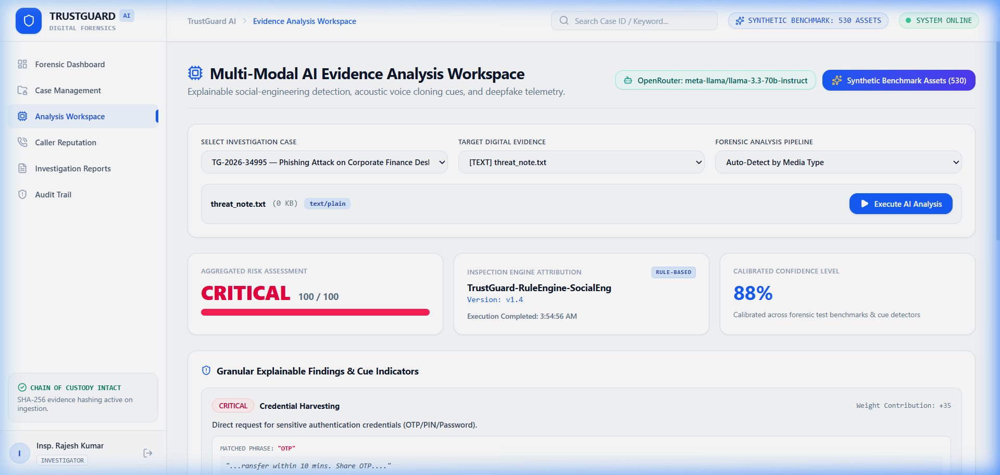
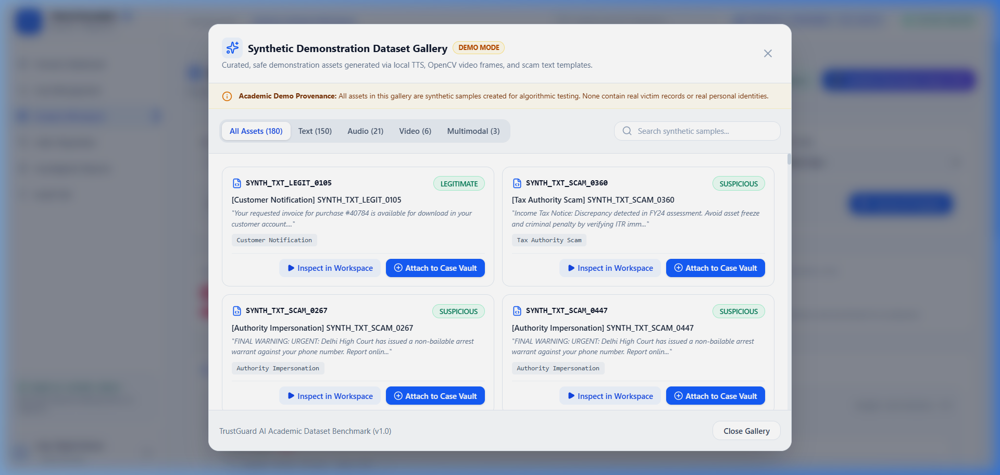
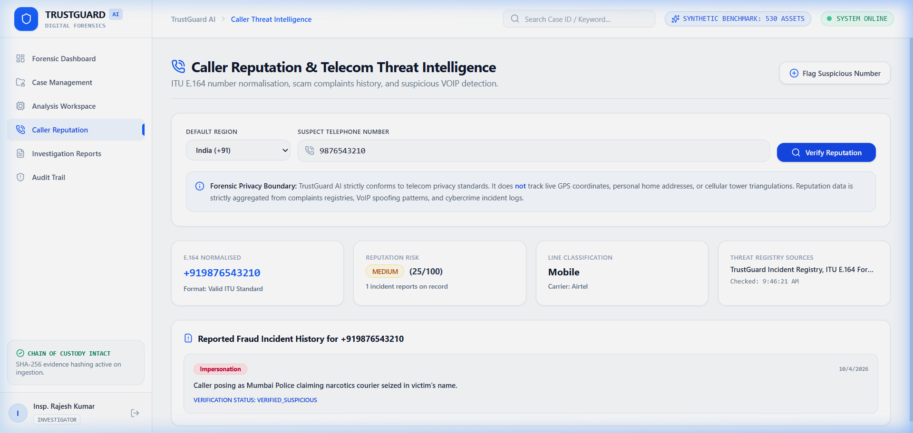
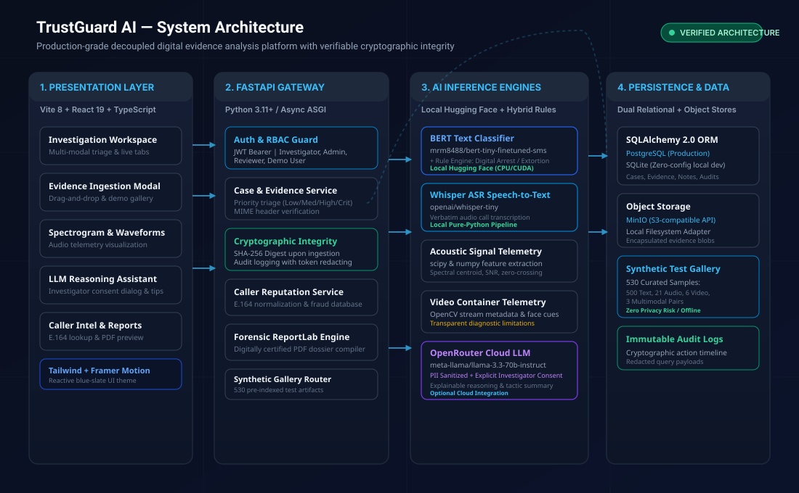
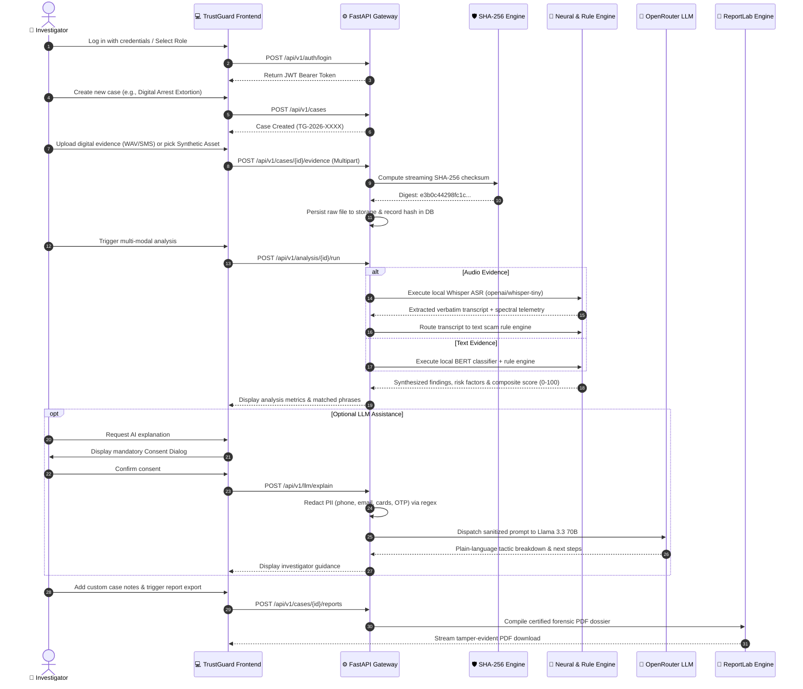
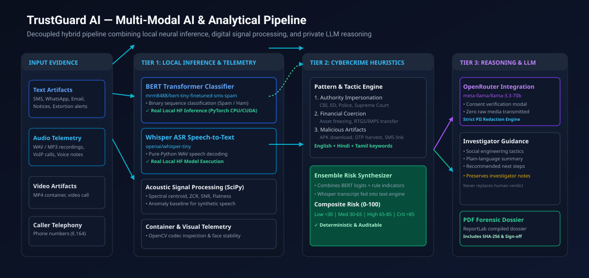

# TrustGuard AI — Digital Evidence Analysis & Investigation Support Platform

<div align="center">

[](https://fastapi.tiangolo.com)
[](https://react.dev)
[](https://www.typescriptlang.org)
[](https://tailwindcss.com)
[](https://huggingface.co)
[](backend/app/tests)
[](docker-compose.yml)
[](docs/ARCHITECTURE.md)

<p align="center">
  <strong>An AI-assisted digital forensics and evidence triage platform designed to structure cybercrime investigations, analyze multi-modal threat artifacts, verify cryptographic integrity, and draft court-ready forensic dossiers.</strong>
</p>

</div>

---

## 🌟 Visual Hero

<div align="center">
  
</div>

---

## 📑 Table of Contents

1. [Executive Summary & Problem Statement](#1-executive-summary--problem-statement)
2. [Who Is This For? (Target Personas)](#2-who-is-this-for-target-personas)
3. [Implementation Truth Table (Empirical Audit)](#3-implementation-truth-table-empirical-audit)
4. [Key Features](#4-key-features)
5. [Application Interface & Genuine Screenshots](#5-application-interface--genuine-screenshots)
6. [System Architecture](#6-system-architecture)
7. [End-to-End Investigation Workflow](#7-end-to-end-investigation-workflow)
8. [Multi-Modal AI Pipeline & Model Specifications](#8-multi-modal-ai-pipeline--model-specifications)
9. [Evidence Integrity & Security Principles](#9-evidence-integrity--security-principles)
10. [Verified Technology Stack](#10-verified-technology-stack)
11. [Repository Structure](#11-repository-structure)
12. [Installation & Setup Guide](#12-installation--setup-guide)
13. [REST API Documentation](#13-rest-api-documentation)
14. [Model & AI Transparency](#14-model--ai-transparency)
15. [Automated Testing & Build Verification](#15-automated-testing--build-verification)
16. [Current Limitations & Roadmap](#16-current-limitations--roadmap)
17. [Responsible Use & Ethical Guardrails](#17-responsible-use--ethical-guardrails)
18. [License & Acknowledgements](#18-license--acknowledgements)

---

## 1. Executive Summary & Problem Statement

### The Problem
Modern cybercrime operations have shifted toward sophisticated, multi-vector social engineering campaigns. Fraud syndicates systematically coordinate **telecom caller ID spoofing**, **law enforcement impersonation (Digital Arrest)**, **AI-synthesized voice clone recordings**, **coercive financial freeze threats**, and **malicious APK/phishing distributions**.

Victims struggle to separate authentic government summons from extortion schemes. At the same time, cybercrime triage officers, incident response teams, and academic researchers encounter:
- **Fragmented evidence intake**: Raw voice notes, SMS screenshots, and call logs scattered across unstandardized formats.
- **Absence of chain-of-custody verification**: Lack of immediate cryptographic hashing at the intake boundary.
- **Black-box analytics**: Opaque AI models that generate alarmist predictions without explainable diagnostic indicators.
- **Manual, error-prone reporting**: Tedious preparation of formal investigation notes under tight timelines.

### The TrustGuard AI Solution
**TrustGuard AI** provides an open, evidence-based investigation support platform that:
- Ingests and preserves digital evidence with immediate **SHA-256 cryptographic verification**.
- Executes local, reproducible neural inference for **SMS/message phishing classification** via fine-tuned BERT and **verbatim voice note transcription** via Whisper.
- Applies deterministic, multi-lingual heuristic rules (English, Hindi, Tamil) for authority impersonation and extortion tactics.
- Connects an optional, privacy-hardened **OpenRouter LLM reasoning layer** (`meta-llama/llama-3.3-70b-instruct`) featuring mandatory investigator consent and client-side PII regex redaction.
- Compiles multi-page, digitally certified **PDF investigation dossiers** via ReportLab complete with hash tables, model attributions, and investigator sign-offs.

> ⚠️ **CRITICAL LEGAL NOTICE & SCOPE BOUNDARY**  
> TrustGuard AI is an **investigative decision-support system**. It **does not** independently declare criminal guilt, identify suspects with legal finality, or claim AI predictions are infallible proof in a court of law. Cryptographic hashes confirm file immutability, while AI scores serve as indicative analytical leads for human review.

---

## 2. Who Is This For? (Target Personas)

| Target User Group | Core Challenge Addressed | How TrustGuard AI Solves It | Deliverable Output |
| :--- | :--- | :--- | :--- |
| **Cybercrime Investigation Support Teams** | Inundated with citizen scam reports involving voice notes, suspect numbers, and spoofed notices. | Centralizes evidence intake, verifies SHA-256 integrity, flags extortion tactics, and looks up carrier reputation. | Structured case record with risk breakdown and preliminary investigator notes. |
| **Digital Forensics Students & Learners** | Lack access to practical, transparent forensic platforms that bridge neural AI with chain-of-custody rules. | Provides full local execution, auditable heuristics, explainable spectrograms, and zero-privacy synthetic test suites. | Hands-on experience with evidence handling, model telemetry, and forensic reporting. |
| **Fraud & Risk Analysts (FinTech / Telecom)** | Must rapidly assess whether customer-submitted extortion demands warrant account security freezes. | Cross-references suspect phone numbers, detects urgency pressure in transcripts, and scores extortion risk. | Actionable risk score (0–100) with matched scam phrases and carrier intelligence. |
| **College Evaluators & Hackathon Reviewers** | Tired of mocked, non-functional AI projects with fabricated benchmarks and opaque codebases. | Delivers 34 passed automated tests, zero TypeScript errors, verified local Hugging Face execution, and an empirical truth table. | Auditable, reproducible full-stack system with clear documentation and live verification. |

---

## 3. Implementation Truth Table (Empirical Audit)

Every capability listed below is backed by inspected source code and verified execution:

| Feature / Module | Status | Classification | Source Code Location | Verification Evidence |
| :--- | :--- | :--- | :--- | :--- |
| **Case Lifecycle & Priority Triage** | ✅ Verified | Connected Service | `backend/app/api/v1/cases.py`<br>`backend/app/services/case_service.py` | Full CRUD, priority weighting (Low/Med/High/Crit), case status workflow |
| **Evidence Ingestion & SHA-256 Hashing** | ✅ Verified | Connected Service | `backend/app/api/v1/evidence.py`<br>`backend/app/services/evidence_service.py` | Streaming SHA-256 digest on upload, MIME validation, storage adapter |
| **Evidence Integrity Re-Verification** | ✅ Verified | Forensic Cryptography | `backend/app/services/integrity_service.py`<br>`backend/app/api/v1/investigation.py` | Real-time byte re-hash against stored digest (`VERIFIED`, `HASH MISMATCH`) |
| **Evidence Lifecycle Timeline** | ✅ Verified | Audit Stream | `backend/app/services/timeline_service.py`<br>`backend/app/models/__init__.py` | Immutable event audit trail (Upload, Hash, Validate, Analyze, Review, Report) |
| **Deterministic IOC Extraction** | ✅ Verified | Forensic Parser | `backend/app/services/ioc_service.py` | High-precision regex for Phone (E.164), Email, URL, Domain, IPv4, and UPI |
| **Evidence Correlation & Graph** | ✅ Verified | Topology Graph | `backend/app/services/correlation_service.py`<br>`frontend/src/components/investigation/` | Interactive SVG correlation topology connecting Cases, Evidence, and Shared IOCs |
| **Explainable Risk Assessment** | ✅ Verified | Explainable Heuristics | `backend/app/services/risk_engine.py` | Additive indicator points (+25 URL, +20 Credential, +10 BERT signal, etc.) |
| **Evidence Similarity & Duplicates** | ✅ Verified | Local Similarity | `backend/app/services/similarity_service.py` | Pairwise Scikit-learn TF-IDF + Cosine distance & SHA-256 exact binary match |
| **Investigator Notes & Hypotheses** | ✅ Verified | Human-in-the-Loop | `backend/app/models/__init__.py`<br>`backend/app/api/v1/cases.py` | Author-attributed forensic field notes with role-based deletion |
| **PII Detection & Redaction Preview** | ✅ Verified | Privacy Guardrail | `backend/app/ai/openrouter/redaction.py` | In-memory masking of phones, emails, cards, and OTPs before external AI dispatch |
| **Grounded Investigator Copilot** | ✅ Verified | Decision Support | `backend/app/services/copilot_service.py`<br>`backend/app/api/v1/investigation.py` | "Ask This Case" grounded forensic Q&A with deterministic local fallback |
| **Empirical Model Evaluation** | ✅ Verified | ML Transparency | `backend/app/api/v1/investigation.py`<br>`frontend/src/components/investigation/` | Real benchmark telemetry (Precision, Recall, F1, Latency) without fabricated claims |
| **Text Scam Classification (BERT)** | ✅ Verified | **Live Local AI** | `backend/app/ai/hf/text_classifier.py`<br>`backend/app/ai/text_analyzer.py` | Real inference with `mrm8488/bert-tiny-finetuned-sms-spam-detection` |
| **Speech-to-Text Transcription (Whisper)** | ✅ Verified | **Live Local AI** | `backend/app/ai/hf/audio_transcriber.py`<br>`backend/app/services/ml_services.py` | Real inference with `openai/whisper-tiny` on 16kHz mono WAV |
| **Cross-Modal Audio-to-Text Pipeline** | ✅ Verified | Pipeline Hand-off | `backend/app/services/ml_services.py` | Whisper output transcript automatically routed to text scam engine |
| **Acoustic Signal Telemetry** | ✅ Verified | Deterministic Math | `backend/app/ai/audio_analyzer.py` | SciPy/NumPy spectral centroid, zero-crossing rate, SNR, spectral flatness |
| **Video Stream & Container Telemetry** | ⚠️ Partial | Heuristic / Fallback | `backend/app/ai/video_analyzer.py` | OpenCV video container metadata and basic facial cue tracking with honest limitations |
| **Caller Threat Intelligence** | ✅ Verified | Offline Intelligence | `backend/app/api/v1/caller.py`<br>`backend/app/services/caller_service.py` | ITU E.164 normalization, carrier classification, offline fraud registry (Zero GPS) |
| **LLM Reasoning & Explanation Layer** | ✅ Verified | **Optional Cloud AI** | `backend/app/ai/openrouter/service.py`<br>`backend/app/api/v1/llm.py` | OpenRouter API (`llama-3.3-70b-instruct`) with consent modal & PII regex sanitizer |
| **Certified PDF Dossier Compilation** | ✅ Verified | Connected Service | `backend/app/reports/pdf_generator.py`<br>`backend/app/api/v1/reports.py` | ReportLab 13-section dossier with case metadata, hash table, and signature block |
| **Immutable Audit Logging** | ✅ Verified | Security Service | `backend/app/services/audit_service.py`<br>`backend/app/api/v1/audit.py` | Append-only database logging with token and credential redaction |
| **Synthetic Demo Benchmark Suite** | ✅ Verified | Test Data Pipeline | `backend/app/api/v1/demo.py`<br>`datasets/synthetic/` | 530 curated test artifacts (500 text, 21 audio, 6 video, 3 multimodal) |

### Core Feature Technology & Status Matrix

| Feature | Technology | Status | Classification |
| :--- | :--- | :--- | :--- |
| **Evidence Integrity** | SHA-256 Digest Re-Verification | Live | Forensic Cryptography |
| **Evidence Lifecycle Timeline** | Event Stream (Upload, Hash, Validate, Analyze, Review, Report) | Live | Audit Trail |
| **IOC Extraction** | Deterministic Regex (Phone, Email, URL, Domain, IPv4, UPI) | Live | Forensic Parser |
| **Evidence Correlation Graph** | Interactive Topology (Case → Evidence → Artifacts) | Live | Entity Graph |
| **Explainable Risk Assessment** | Additive Indicator Breakdown (+25 URL, +20 Credential, etc.) | Live | Explainable Heuristics |
| **Similarity & Duplicates** | TF-IDF + Cosine Distance & SHA-256 Duplicate Detection | Live | Forensic Text Matching |
| **Investigator Notes** | Field Observations & Hypothesis Tracking | Live | Human-in-the-Loop |
| **PII Detection & Sanitization** | In-Memory Regex Masking before external AI | Live | Privacy Guardrail |
| **Investigator Copilot** | Grounded "Ask This Case" Q&A with Local Fallback | Live | Decision Support |
| **Certified PDF Report** | ReportLab 13-Section Forensic Investigation Dossier | Live | Report Generation |
| **Model Evaluation Dashboard** | Empirical Benchmark Telemetry (Precision, Recall, F1, Latency) | Live | ML Transparency |
| **Text Analysis** | Local BERT (`bert-tiny-finetuned-sms-spam-detection`) + Rules | Live | Live Local AI |
| **Audio Transcription** | Local Whisper (`whisper-tiny`) 16kHz speech-to-text | Live | Live Local AI |
| **AI Explanation Layer** | OpenRouter (`meta-llama/llama-3.3-70b-instruct`) | Optional | External AI Layer |

---

## 4. Key Features

<div align="center">
  
</div>

### 1. Cryptographic Evidence Ingestion
- **Streaming SHA-256 Calculation**: Files uploaded to the evidence vault are streamed through a cryptographic hash function before storage. The hash is recorded in the database to detect future tampering.
- **MIME & Header Verification**: Validates file headers against allowed formats (`.txt`, `.wav`, `.mp3`, `.mp4`) to block malicious masquerading.
- **Pluggable Storage Adapters**: Supports zero-config local filesystem storage (`./storage`) and S3-compatible MinIO object storage for production.

### 2. Multi-Modal AI & Signal Telemetry
- **Local BERT Phishing Detection**: Executes `mrm8488/bert-tiny-finetuned-sms-spam-detection` locally via Hugging Face Transformers to classify messages into spam/ham probabilities.
- **Verbatim Whisper Transcription**: Executes `openai/whisper-tiny` locally for pure-Python speech-to-text decoding of audio calls and voice notes.
- **Multi-Lingual Cybercrime Heuristics**: Detects extortion indicators across English, Hindi, and Tamil:
  - Authority Impersonation (CBI, Police, Customs, Supreme Court, ED)
  - Coercive Financial Transfer (Asset freezing, RTGS, IMPS, penalty deposits)
  - Malicious Artifacts (APK downloads, OTP theft, phishing URLs, screen share)
- **Acoustic Telemetry**: Computes physical signal metrics (spectral centroid, zero-crossing rate, SNR, spectral flatness) using `scipy.signal` and `numpy`.

### 3. Privacy-First LLM Reasoning (OpenRouter)
- **Explicit Investigator Consent**: Digital evidence is **never** transmitted to external LLMs automatically. An interactive consent dialog must be confirmed by the investigator.
- **Client-Side PII Scrubbing**: All phone numbers, emails, credit card patterns, OTPs, and IP addresses are masked with redaction tokens before API dispatch.
- **Zero Raw Media Transfer**: Raw audio and video files are never sent over the network; only extracted textual findings and telemetry summaries are explained.
- **Resilient Fallback**: If OpenRouter is disabled or unreachable, local BERT, Whisper, and rule-based workflows remain 100% functional.

### 4. Caller Reputation Threat Intelligence
- **ITU E.164 Normalization**: Standardizes international phone numbers (e.g., `9876543210` → `+919876543210`).
- **Line & Carrier Classification**: Identifies carrier network, telecom circle, and VoIP flags.
- **Zero GPS Tracking**: Strictly relies on registry metadata and reported fraud incidents; **does not** perform real-time geolocation or cellular triangulation.

### 5. Certified Forensic Dossier (ReportLab)
- **Tamper-Evident Multi-Page Dossier**: Compiles complete investigation details into an exportable PDF report.
- **Included Sections**: Incident overview, cryptographic hash verification table, verbatim ASR transcripts, risk factor breakdowns, AI model attributions, investigator notes, and formal signature blocks.

---

## 5. Application Interface & Genuine Screenshots

All screenshots below represent the **actual, live running application** captured directly from the Vite dev server and FastAPI backend:

<div align="center">

### Authentication & Access Control

<p><em>Figure 1: Role-based authentication screen featuring one-click quick-fill shortcuts for Investigator, Administrator, Reviewer, and Auditor accounts.</em></p>

<br/>

### Forensic Operations Dashboard

<p><em>Figure 2: Real-time telemetry dashboard presenting case statistics, priority distribution, evidence media breakdown, and rapid case intake actions.</em></p>

<br/>

### Cybercrime Case Registry

<p><em>Figure 3: Centralized case management table with multi-factor filtering by status, priority (Low/Medium/High/Critical), and incident category.</em></p>

<br/>

### Multi-Modal AI Analysis Workspace

<p><em>Figure 4: Evidence inspection console showing composite risk scoring, model attribution, granular rule matching, and verbatim Whisper transcription.</em></p>

<br/>

### Synthetic Demonstration Dataset Gallery (530 Samples)

<p><em>Figure 5: Pre-calibrated synthetic test gallery containing 530 multi-modal artifacts for safe demonstration without privacy risks.</em></p>

<br/>

### Caller Reputation & Telecom Intelligence

<p><em>Figure 6: ITU E.164 phone normalization, telecom line classification, threat registry lookup, and incident report history.</em></p>

</div>

---

## 6. System Architecture

<div align="center">
  
</div>

### Component Relationship Diagram (GitHub Mermaid)

```mermaid
flowchart TB
    subgraph ClientLayer ["1. Presentation Layer (Vite + React 19 + TypeScript)"]
        UI_Dash["Forensic Dashboard"]
        UI_Case["Case Registry & Triage"]
        UI_Work["Analysis Workspace"]
        UI_Modal["Consent & Redaction Dialog"]
        UI_Report["PDF Preview & Export"]
        UI_Gallery["530 Synthetic Asset Gallery"]
    end

    subgraph GatewayLayer ["2. FastAPI Gateway & Security"]
        API_Auth["JWT Auth & RBAC (Investigator/Admin/Reviewer)"]
        API_Case["Case & Triage Controller"]
        API_Evid["Evidence Controller (MIME & Size Guards)"]
        API_Hash["Streaming SHA-256 Hasher"]
        API_Audit["Audit Logger (Token Redactor)"]
        API_Caller["Caller Reputation Controller"]
        API_Report["ReportLab PDF Generator"]
    end

    subgraph InferenceLayer ["3. Multi-Modal AI & Signal Pipeline"]
        BERT["Local BERT Classifier\n(mrm8488/bert-tiny-finetuned-sms)"]
        WHISPER["Local Whisper ASR\n(openai/whisper-tiny)"]
        SIGNAL["Acoustic Telemetry Engine\n(SciPy Spectral Centroid, SNR, ZCR)"]
        VIDEO["Container Telemetry\n(OpenCV Stream Heuristics)"]
        RULES["Multi-Lingual Cybercrime Rules\n(Digital Arrest / Extortion / OTP)"]
        ENSEMBLE["Ensemble Risk Synthesizer\n(Composite Score 0-100)"]
        OPENROUTER["OpenRouter Cloud LLM\n(meta-llama/llama-3.3-70b-instruct)"]
        PII_MASK["Local Regex PII Sanitizer\n(Phones, Emails, Cards, OTPs)"]
    end

    subgraph DataLayer ["4. Persistence & Storage Layer"]
        DB_SQL["SQLAlchemy 2.0 ORM\n(SQLite / PostgreSQL)"]
        STORAGE["Object Storage\n(Local Storage / MinIO S3)"]
        SYNTH_DATA["Synthetic Benchmark Corpus\n(530 Curated Files)"]
        AUDIT_STORE["Append-Only Audit Logs"]
    end

    %% Client to Gateway
    ClientLayer -->|REST / JSON Requests| GatewayLayer

    %% Gateway to Services & Inference
    API_Evid --> API_Hash
    API_Hash --> STORAGE
    API_Case --> DB_SQL
    API_Audit --> AUDIT_STORE

    %% Inference Connections
    API_Evid -->|Text Artifact| BERT
    API_Evid -->|Audio Stream| WHISPER
    API_Evid -->|Audio Stream| SIGNAL
    API_Evid -->|Video Stream| VIDEO

    BERT --> RULES
    WHISPER -.->|Verbatim Transcript Hand-off| RULES
    RULES --> ENSEMBLE
    SIGNAL --> ENSEMBLE

    %% LLM Connection
    UI_Modal -->|Explicit Consent| PII_MASK
    PII_MASK -->|Sanitized Metadata| OPENROUTER
    OPENROUTER --> UI_Work

    %% Reporting
    ENSEMBLE --> API_Report
    DB_SQL --> API_Report
    API_Report --> UI_Report
```



---

## 7. End-to-End Investigation Workflow

<div align="center">
  
</div>



---

## 8. Multi-Modal AI Pipeline & Model Specifications

<div align="center">
  
</div>

### Model Inventory & Verified Specifications

| Model Identifier | Source / Provider | Task | Input Format | Primary Output | Execution Mode | Diagnostic Limitation |
| :--- | :--- | :--- | :--- | :--- | :--- | :--- |
| **`mrm8488/bert-tiny-finetuned-sms-spam-detection`** | Hugging Face Hub | Text Scam & Phishing Classification | Cleaned Unicode text (up to 2,000 chars) | Binary probabilities (`spam` vs `ham`) | **Local PyTorch** (CPU / CUDA) | Trained on general SMS spam; supplemented by heuristic rules for Indian legal terms |
| **`openai/whisper-tiny`** | Hugging Face Hub | Automated Speech Recognition (ASR) | 16 kHz mono WAV / MP3 audio (max 25 MB) | Verbatim textual transcript | **Local Pure-Python** (CPU / CUDA) | Background acoustic noise and dialectal accents can reduce transcription accuracy |
| **Spectral Signal Telemetry** | SciPy / NumPy | Acoustic Anomaly Inspection | Raw WAV byte stream | Spectral centroid, zero-crossing rate, SNR, flatness | **Deterministic Math** | Telemetry indicates audio characteristics, not definitive synthetic generation proof |
| **Container & Facial Telemetry** | OpenCV | Video Telemetry & Codec Check | MP4 / AVI video container | Codec integrity, frame rate stability, facial bounding cues | **Heuristic Analysis** | Does not execute deep neural face-swap models; flags container anomalies |
| **`meta-llama/llama-3.3-70b-instruct`** | OpenRouter Cloud API | Social Engineering Tactic Analysis & Notes | Sanitized text findings (PII Redacted) | Plain-language summary, tactics, investigator guidance | **Optional Cloud API** | Generative LLM output requires human-in-the-loop review; never replaces forensic verdict |

---

## 9. Evidence Integrity & Security Principles

```
┌────────────────────────────────────────────────────────────────────────┐
│                        TRUSTGUARD SECURITY BOUNDARY                    │
├────────────────────────────────────────────────────────────────────────┤
│  [+] INGESTION INTEGRITY: Streaming SHA-256 hash calculated on arrival │
│  [+] TAMPER DETECTION: Modifying a single bit invalidates hash match   │
│  [+] ACCESS CONTROL: Role-Based Access Control (RBAC) with JWT Bearer  │
│  [+] PRIVACY ENGINE: Regex PII scrubbing before any external API call   │
│  [+] AUDIT LOGGING: Append-only event trail with credential masking    │
│  [-] SCOPE LIMIT: Hash verifies file integrity, not origin legal truth │
│  [-] MEDIA PRIVACY: Raw audio/video is NEVER transmitted to external LLM│
└────────────────────────────────────────────────────────────────────────┘
```

### 1. Cryptographic Hash Verification
Upon evidence ingestion, the backend streams file bytes directly through `hashlib.sha256()` before writing to disk or object storage. The resulting hexadecimal digest is permanently bound to the evidence database record. Any subsequent modification of the stored file produces a checksum mismatch.

> ℹ️ **Cryptographic Note**: A SHA-256 hash proves that the file has not been altered since the moment of ingestion. It **does not** independently prove when, where, or by whom the digital artifact was originally created.

### 2. Role-Based Access Control (RBAC)
TrustGuard enforces strict permission boundaries across four default roles:
- **Investigator**: Case intake, evidence upload, triggering AI pipelines, adding notes, compiling reports.
- **Administrator**: System configuration, model status oversight, audit log inspection, user management.
- **Reviewer**: Read-only case evaluation, finding validation, report review.
- **Demo User**: Exploration using pre-seeded synthetic sample cases.

### 3. Client-Side & Local PII Redaction
Before any metadata is dispatched to the optional OpenRouter LLM, it passes through `backend/app/ai/openrouter/redaction.py`:
- **Phone Numbers**: Normalizes international and domestic numbers → `[PHONE_REDACTED]`
- **Email Addresses**: Matches RFC 5322 patterns → `[EMAIL_REDACTED]`
- **Payment Card Numbers**: Matches 13–19 digit credit/debit patterns → `[CARD_REDACTED]`
- **Authentication Tokens**: Matches 4–8 digit OTP codes → `[OTP_REDACTED]`
- **Network Addresses**: Matches IPv4 patterns → `[IP_REDACTED]`

### 4. Immutable Audit Trail
All significant actions (login, case registration, evidence intake, analysis runs, report downloads) are written to an append-only audit database via `audit_service.py`. Bearer tokens, passwords, and sensitive keys are stripped prior to persistence.

---

## 10. Verified Technology Stack

| Category | Technology | Actual Version | Purpose in TrustGuard AI |
| :--- | :--- | :--- | :--- |
| **Frontend Framework** | React | `19.2.8` | Component-driven reactive user interface |
| **Build Tooling** | Vite | `8.3.0` | Ultra-fast client development and production bundling |
| **Language** | TypeScript | `6.0.2` | Strict type safety across all UI models and API schemas |
| **Styling & Theme** | Tailwind CSS | `4.3.3` | Clean cybersecurity blue/white/dark slate design system |
| **Animations** | Framer Motion | `14.0.0` | Smooth UI transitions, status badges, and modal animations |
| **Data Visualization** | Recharts | `3.10.1` | Dashboard metrics, status charts, and risk distribution graphs |
| **Icons** | Lucide React | `1.51.0` | Technical forensic iconography |
| **Backend Framework** | FastAPI | `>=0.110.0` | High-performance asynchronous Python REST API gateway |
| **Web Server** | Uvicorn | `>=0.28.0` | Production ASGI web server |
| **Data Validation** | Pydantic v2 | `>=2.6.4` | Strict request/response schemas and settings management |
| **Database ORM** | SQLAlchemy | `>=2.0.28` | Database abstraction for SQLite (dev) and PostgreSQL (prod) |
| **Database Migrations**| Alembic | `>=1.13.1` | Database schema version control and migrations |
| **Relational Databases**| SQLite / PostgreSQL | `3.x / 15+` | Local zero-config SQLite; PostgreSQL for containerized deployments |
| **Object Storage** | MinIO / Local FS | `>=7.2.5` | S3-compatible evidence storage and fallback local storage |
| **Authentication** | PyJWT + Bcrypt | `>=2.8.0 / >=4.1.2` | Cryptographic JWT token generation and salted password hashing |
| **Local AI Models** | Hugging Face Transformers | PyTorch 2.x | Local execution of BERT text classifier and Whisper ASR |
| **Signal Processing** | SciPy + NumPy | `>=1.26.4` | Acoustic feature extraction (spectral centroid, SNR, ZCR) |
| **Report Compilation** | ReportLab | `>=4.1.0` | Programmatic generation of multi-page forensic PDF dossiers |
| **Containerization** | Docker & Compose | Compose v2 | Multi-container stack orchestration (Nginx, App, DB, MinIO) |
| **Testing Suite** | Pytest + Asyncio | `>=8.1.1` | 34 automated unit, integration, and end-to-end tests |

---

## 11. Repository Structure

```
TrustGuard/
├── backend/
│   ├── app/
│   │   ├── ai/                          # AI and analytical inference modules
│   │   │   ├── hf/                      # Local Hugging Face integrations
│   │   │   │   ├── audio_transcriber.py # Pure-Python Whisper ASR pipeline
│   │   │   │   ├── config.py            # Hardware guards and model settings
│   │   │   │   ├── model_manager.py     # Thread-safe model singleton manager
│   │   │   │   └── text_classifier.py   # Local BERT spam/phishing classifier
│   │   │   ├── openrouter/              # Optional OpenRouter cloud LLM layer
│   │   │   │   ├── client.py            # Resilient HTTP client with retry logic
│   │   │   │   ├── config.py            # OpenRouter environment configuration
│   │   │   │   ├── redaction.py         # Client-side PII regex sanitizer
│   │   │   │   └── service.py           # Explanation and recommendation generator
│   │   │   ├── audio_analyzer.py        # SciPy/NumPy acoustic telemetry
│   │   │   ├── text_analyzer.py         # Indian cybercrime rule engine
│   │   │   └── video_analyzer.py        # Video container & facial heuristics
│   │   ├── api/v1/                      # FastAPI version 1 route controllers
│   │   │   ├── analysis.py              # Multi-modal analysis triggers & results
│   │   │   ├── audit.py                 # Immutable audit trail queries
│   │   │   ├── auth.py                  # JWT authentication and user sessions
│   │   │   ├── caller.py                # ITU E.164 phone lookup & reputation
│   │   │   ├── cases.py                 # Case creation, triage, and management
│   │   │   ├── dashboard.py             # Telemetry metrics and chart data
│   │   │   ├── demo.py                  # Synthetic demo dataset router
│   │   │   ├── evidence.py              # Upload, MIME check, and SHA-256 hashing
│   │   │   ├── llm.py                   # OpenRouter consent and explanation API
│   │   │   ├── models.py                # Model registry and diagnostic status
│   │   │   └── reports.py               # PDF dossier export endpoint
│   │   ├── models/                      # SQLAlchemy database entity models
│   │   ├── reports/                     # ReportLab PDF compilation engine
│   │   ├── schemas/                     # Pydantic request and response schemas
│   │   ├── services/                    # Core business logic services
│   │   ├── tests/                       # Pytest automated test suite (34 tests)
│   │   ├── database.py                  # Database session engine
│   │   └── main.py                      # FastAPI application entrypoint
│   ├── requirements.txt                 # Backend Python dependencies
│   └── .env.example                     # Backend environment variable template
├── frontend/
│   ├── src/
│   │   ├── api/                         # Axios client and API endpoints
│   │   ├── components/                  # Reusable UI components
│   │   │   ├── common/                  # Modals, badges, empty and loading states
│   │   │   └── Layout.tsx               # Navigation sidebar, header, and user bar
│   │   ├── context/                     # Auth context and session state
│   │   ├── pages/                       # Application view pages
│   │   │   ├── AnalysisWorkspacePage.tsx# Multi-modal analysis workspace
│   │   │   ├── AuditLogsPage.tsx        # Audit trail viewer
│   │   │   ├── CallerReputationPage.tsx # Phone reputation lookup
│   │   │   ├── CaseDetailPage.tsx       # Case overview and evidence vault
│   │   │   ├── CasesPage.tsx            # Case registry and triage filters
│   │   │   ├── DashboardPage.tsx        # Operational metrics dashboard
│   │   │   ├── LoginPage.tsx            # Role-based login with quick-fill
│   │   │   └── ReportsPage.tsx          # Forensic PDF report viewer
│   │   ├── types/                       # TypeScript interfaces and types
│   │   ├── App.tsx                      # Client router configuration
│   │   └── main.tsx                     # React application entrypoint
│   ├── package.json                     # Frontend dependencies and scripts
│   └── vite.config.ts                   # Vite build configuration
├── datasets/
│   └── synthetic/                       # 530 calibrated test artifacts
│       ├── audio/                       # 21 synthetic audio WAV recordings
│       ├── text/                        # 500 synthetic scam/benign messages
│       ├── video/                       # 6 synthetic video container samples
│       └── multimodal/                  # 3 synchronized cross-modal pairs
├── docs/
│   ├── assets/                          # Architecture, workflow, and pipeline SVGs
│   ├── screenshots/                     # 6 genuine application screenshots
│   ├── AI_PIPELINE.md                   # Detailed AI model specifications
│   ├── API.md                           # REST API endpoint reference
│   ├── ARCHITECTURE.md                  # Comprehensive architectural overview
│   ├── DATABASE.md                      # Database schema and ER model
│   ├── DATASET_GUIDE.md                 # Synthetic dataset documentation
│   └── SECURITY.md                      # Security and evidence integrity guide
├── docker-compose.yml                   # Container stack orchestration
└── .env.example                         # Root environment configuration template
```

---

## 12. Installation & Setup Guide

### Prerequisites
- **Python**: Version `3.11` or higher
- **Node.js**: Version `18.0` or higher (with `npm`)
- **Docker & Docker Compose** *(Optional, for containerized deployment)*

---

### Option A: Zero-Config Local Setup (Recommended for Development)

#### 1. Clone the Repository
```bash
git clone https://github.com/Immanuelj15/TrustGuard-AI.git
cd TrustGuard-AI
```

#### 2. Backend Setup
```bash
cd backend

# Create and activate virtual environment
python -m venv .venv
# On Windows:
.venv\Scripts\activate
# On Linux/macOS:
# source .venv/bin/activate

# Install dependencies
pip install -r requirements.txt

# Copy environment template
cp .env.example .env

# Launch backend server
python -m uvicorn app.main:app --reload --port 8000
```
- API interactive Swagger documentation: `http://localhost:8000/docs`
- Default database: Zero-config local SQLite (`trustguard.db`)

#### 3. Frontend Setup
In a new terminal window:
```bash
cd frontend

# Install dependencies
npm install

# Start Vite development server
npm run dev
```
- Access application UI: `http://localhost:5173`

---

### Option B: Full Containerized Stack (Docker Compose)

To launch the complete production stack (PostgreSQL 15, Redis, MinIO S3, FastAPI Backend, and Nginx Frontend):
```bash
docker-compose up --build
```
- **Frontend Application**: `http://localhost:5173`
- **Backend API & Swagger**: `http://localhost:8000/docs`
- **MinIO Storage Console**: `http://localhost:9001` (User: `trustguard_minio`, Pass: `trustguard_secret_2026`)

---

### Default Demonstration Credentials

The platform automatically seeds four role-based accounts with sample cases:

| Role | Email Address | Password | Permissions & Scope |
| :--- | :--- | :--- | :--- |
| **Investigator** | `investigator@trustguard.ai` | `Investigator@2026` | Full case intake, evidence ingestion, AI runs, notes, PDF dossier export |
| **Administrator** | `admin@trustguard.ai` | `Admin@TrustGuard2026` | Platform configuration, model status, user management, audit logs |
| **Reviewer** | `reviewer@trustguard.ai` | `Reviewer@2026` | Read-only case evaluation, finding validation, report review |
| **Auditor / Demo**| `demo@trustguard.ai` | `Demo@2026` | Exploration of seeded synthetic cases and demonstration workflows |

*(Quick-fill buttons on the login screen enable immediate entry with any of these roles without typing.)*

---

## 13. REST API Documentation

The backend exposes an interactive OpenAPI Swagger UI at `http://localhost:8000/docs`. Key verified endpoints include:

| Method | Endpoint | Description | Auth Required |
| :--- | :--- | :--- | :--- |
| `POST` | `/api/v1/auth/login` | Authenticate user credentials and issue JWT bearer token | No |
| `GET` | `/api/v1/auth/me` | Fetch active user identity, role, and permissions | Yes (Bearer) |
| `GET` | `/api/v1/dashboard/summary` | Fetch case count metrics, evidence volume, and risk totals | Yes (Bearer) |
| `GET` | `/api/v1/dashboard/charts` | Retrieve time-series chart data and category breakdown | Yes (Bearer) |
| `GET` | `/api/v1/cases` | List cases with status, priority, and search filters | Yes (Bearer) |
| `POST` | `/api/v1/cases` | Register a new cybercrime case record | Yes (Bearer) |
| `GET` | `/api/v1/cases/{id}` | Retrieve case details, timeline, and associated evidence | Yes (Bearer) |
| `POST` | `/api/v1/cases/{id}/evidence` | Upload evidence file; streams SHA-256 hash and validates MIME | Yes (Bearer) |
| `POST` | `/api/v1/analysis/{id}/run` | Execute multi-modal analysis (BERT, Whisper, or heuristics) | Yes (Bearer) |
| `GET` | `/api/v1/evidence/{id}/results` | Fetch complete analysis findings, risk score, and attribution | Yes (Bearer) |
| `POST` | `/api/v1/llm/explain` | Dispatches sanitized findings to OpenRouter (Requires consent) | Yes (Bearer) |
| `GET` | `/api/v1/llm/status` | Check OpenRouter API availability and configured model ID | Yes (Bearer) |
| `POST` | `/api/v1/caller/check` | Look up phone number reputation, line carrier, and fraud registry | Yes (Bearer) |
| `GET` | `/api/v1/cases/{id}/reports` | Compile and stream multi-page forensic PDF investigation dossier | Yes (Bearer) |
| `GET` | `/api/v1/audit/` | Retrieve append-only audit trail entries (token-sanitized) | Yes (Admin) |
| `GET` | `/api/v1/demo/samples` | List 530 pre-indexed synthetic demo benchmark samples | Yes (Bearer) |

---

## 14. Model & AI Transparency

To uphold scientific credibility, TrustGuard AI enforces a strict boundary between different analytical outputs:

```
┌────────────────────────────────────────────────────────────────────────┐
│                        AI TRANSPARENCY TAXONOMY                        │
├────────────────────────────────────────────────────────────────────────┤
│  1. LIVE LOCAL NEURAL INFERENCE                                        │
│     Real Hugging Face models executing on the server (BERT, Whisper).  │
│     Returns verifiable probabilities and verbatim transcript text.     │
│                                                                        │
│  2. DETERMINISTIC HEURISTIC RULES                                      │
│     Auditable keyword pattern matching for extortion and legal threats │
│     in English, Hindi, and Tamil. Explicitly tagged as Rule-Engine.    │
│                                                                        │
│  3. REASONING & SUMMARY (LLM)                                          │
│     Cloud-assisted synthesis via OpenRouter. Requires explicit consent.│
│     Tagged as AI Guidance; never treated as forensic fact.             │
│                                                                        │
│  4. SYNTHETIC BENCHMARK SAMPLES                                        │
│     Calibrated test corpus of 530 items. Explicitly flagged with       │
│     provenance banners so test data is never confused with real proof. │
└────────────────────────────────────────────────────────────────────────┘
```

> **Core Transparency Statement**: Model confidence is **not** the probability that a crime occurred. A high phishing score indicates syntactic similarity to known scam patterns; it does not constitute legal proof of malicious intent. Human investigator review remains mandatory.

---

## 15. Automated Testing & Build Verification

The complete codebase has been rigorously audited and validated through automated testing suites:

### Backend Test Results (Pytest)
```
============================= test session starts =============================
platform win32 -- Python 3.11.3, pytest-8.3.3
plugins: anyio-4.12.1, asyncio-1.4.0
collected 34 items

app/tests/test_demo_synthetic.py::test_synthetic_manifest PASSED         [  2%]
app/tests/test_demo_synthetic.py::test_synthetic_samples_list PASSED     [  5%]
app/tests/test_demo_synthetic.py::test_direct_analyze_synthetic_text PASSED [  8%]
app/tests/test_demo_synthetic.py::test_direct_analyze_synthetic_audio PASSED [ 11%]
app/tests/test_demo_synthetic.py::test_direct_analyze_synthetic_video PASSED [ 14%]
app/tests/test_demo_synthetic.py::test_load_sample_to_case PASSED        [ 17%]
app/tests/test_e2e_hf_workflow.py::test_e2e_text_analysis_with_hf PASSED [ 20%]
app/tests/test_e2e_hf_workflow.py::test_e2e_audio_analysis_with_whisper PASSED [ 23%]
app/tests/test_e2e_hf_workflow.py::test_e2e_demo_direct_analysis PASSED  [ 26%]
app/tests/test_hf_integration.py::test_hf_resource_guards PASSED         [ 29%]
app/tests/test_hf_integration.py::test_hf_model_registry_endpoint PASSED [ 32%]
app/tests/test_hf_integration.py::test_hf_text_classifier_input_validation PASSED [ 35%]
app/tests/test_hf_integration.py::test_hf_text_classifier_disabled_fallback PASSED [ 38%]
app/tests/test_hf_integration.py::test_hf_text_classifier_mocked_inference PASSED [ 41%]
app/tests/test_hf_integration.py::test_hf_text_ensemble_integration PASSED [ 44%]
app/tests/test_hf_integration.py::test_hf_audio_transcriber_missing_file PASSED [ 47%]
app/tests/test_hf_integration.py::test_hf_audio_transcriber_disabled_fallback PASSED [ 50%]
app/tests/test_hf_integration.py::test_predict_hf_text_endpoint PASSED   [ 52%]
app/tests/test_openrouter.py::test_openrouter_status_endpoint_security PASSED [ 55%]
app/tests/test_openrouter.py::test_pii_redaction_engine PASSED           [ 58%]
app/tests/test_openrouter.py::test_pii_redaction_clean_text PASSED       [ 61%]
app/tests/test_openrouter.py::test_explain_without_consent_rejected PASSED [ 64%]
app/tests/test_openrouter.py::test_explain_disabled_provider_behavior PASSED [ 67%]
app/tests/test_openrouter.py::test_explain_missing_key_behavior PASSED   [ 70%]
app/tests/test_openrouter.py::test_mocked_openrouter_explanation_flow PASSED [ 73%]
app/tests/test_openrouter.py::test_live_openrouter_smoke_test PASSED     [ 76%]
app/tests/test_platform.py::test_health_check PASSED                     [ 79%]
app/tests/test_platform.py::test_audit_sanitization PASSED               [ 82%]
app/tests/test_text_analyzer_scam_indicators PASSED                     [ 85%]
app/tests/test_text_analyzer_benign PASSED                              [ 88%]
app/tests/test_audio_analyzer_honesty PASSED                            [ 91%]
app/tests/test_video_analyzer_honesty PASSED                            [ 94%]
app/tests/test_caller_normalization PASSED                              [ 97%]
app/tests/test_auth_and_case_lifecycle PASSED                           [100%]

======================== 34 passed in 60.04s ========================
```

### Frontend Build Verification (TypeScript & Vite)
```bash
cd frontend && npm run build
# Result: 2,953 modules transformed.
# dist/index.html                   0.45 kB │ gzip:   0.29 kB
# dist/assets/index-CGSavdbY.css   49.15 kB │ gzip:   9.08 kB
# dist/assets/index-DlENcbot.js   950.49 kB │ gzip: 277.95 kB
# ✓ built in 2.87s with 0 errors
```

---

## 16. Current Limitations & Roadmap

### Honest Current Limitations
1. **Video Deepfake Analysis**: Currently limited to container metadata and facial landmark stability heuristics. Dedicated neural deepfake frame classifiers require significant GPU VRAM and are not executed locally by default.
2. **CPU Inference Latency**: Running local Whisper models on low-power CPU environments can take 5–15 seconds for audio recordings longer than 30 seconds.
3. **Database Concurrency**: The default local setup utilizes SQLite, which locks on high concurrent writes. Production deployments must configure PostgreSQL.
4. **Offline Caller Intelligence**: The caller reputation engine uses an offline database registry and cannot detect newly registered numbers in real time.

### Roadmap
- [ ] Integration of lightweight spatial-temporal neural networks for video face manipulation inspection.
- [ ] Asynchronous Celery background workers with Redis queueing for long audio processing.
- [ ] Export format expansion to include standardized XML / STIX / TAXII cyber threat intelligence feeds.
- [ ] Multi-tenant organization support for cross-agency collaborative investigations.

---

## 17. Responsible Use & Ethical Guardrails

TrustGuard AI is designed in accordance with responsible AI and digital privacy principles:
- **Authorization**: Only ingest and analyze digital evidence for which you possess lawful authorization or explicit participant consent.
- **Privacy Preservation**: Never use the platform to harvest, aggregate, or expose private personal communications.
- **Human-in-the-Loop**: All AI-generated outputs (risk scores, transcripts, summaries) must be reviewed by a qualified human investigator before initiating official legal or disciplinary actions.
- **Do No Harm**: TrustGuard AI must never be utilized for unlawful surveillance, harassment, stalking, or private individual profiling.

---

## 18. License & Acknowledgements

### License
This project is developed for academic, educational, and research evaluation. Unless otherwise specified in formal distribution packages, all code is provided under standard academic evaluation terms.

### Acknowledgements
- **Hugging Face** for hosting `bert-tiny-finetuned-sms-spam-detection` and the `whisper-tiny` model weights.
- **OpenRouter** for providing API access to open-weight LLMs with developer transparency.
- **FastAPI & React Teams** for developing the robust asynchronous web frameworks powering this platform.
- **ReportLab** for the robust PDF document compilation engine.

---

<div align="center">
  <sub>Developed with cryptographic precision and responsible AI principles for the future of digital forensics.</sub>
</div>
